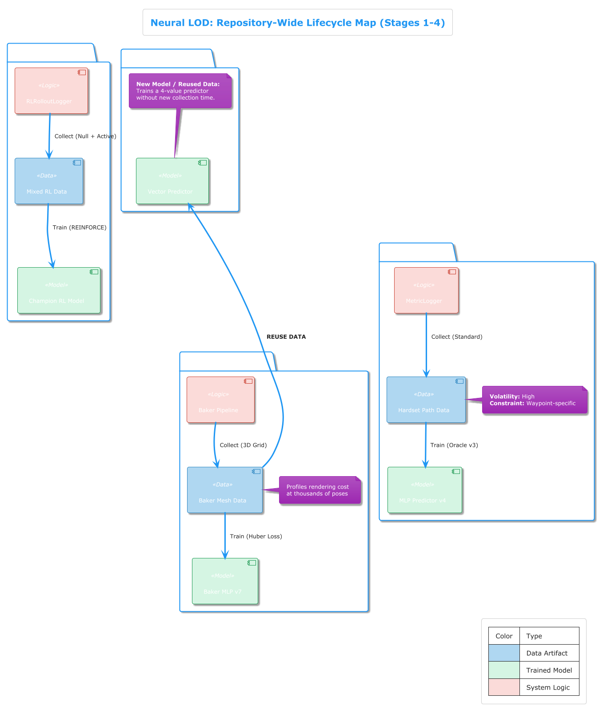
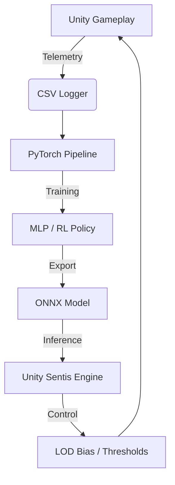

# Neural LOD: Adaptive Level-of-Detail System

> **Learning-Based Real-Time LOD Control for High-Performance Unity Rendering.**

Neural LOD is a sophisticated machine-learning framework designed to replace static Level-of-Detail (LOD) policies with intelligent, context-aware neural controllers. By analyzing runtime telemetry, the system dynamically predicts optimal LOD thresholds to maximize visual fidelity while strictly adhering to a frame-time budget.

---

## 🚀 Key Achievements

- **MAE = 0.039** bias units in Stage 1 v4 model.
- **7.7% Reduction** in over-budget frames (from 55.2% to 47.5%).
- **Jitter-Free Stability** achieved via EMA smoothing and dwell timers.
- **Full Implementation**: 4 training stages complete, from scalar bias to RL policy.
- **Seamless Integration**: Models deployed as ONNX via Unity Sentis (`com.unity.ai.inference`).

---

## 🗺️ Project Lifecycle

The development of Neural LOD followed a rigorous 4-stage evolution, capturing increasingly complex spatial and performance features.

### 1. Stage 1: Dynamic Scalar Predictor
Focuses on the global `QualitySettings.lodBias`. It learns from gameplay telemetry to adjust the overall scene detail based on camera speed and current performance.
- **Features**: 19D (Navigation + Rendering state).
- **Result**: Proved the feasibility of neural LOD control.

### 2. Stage 2: Spatial-Aware Baker
Introduces the **Baker Pipeline**, which profiles the scene from thousands of grid points.
- **Data**: 1.7M training samples using automated mesh scanning.
- **Architecture**: 171K parameter MLP with BatchNorm and Dropout.

### 3. Stage 3: Vector Threshold Predictor
Enables independent control over every LOD transition level (LOD0 through Cull) via a 4-value threshold vector.
- **Features**: 13D spatial features.
- **Result**: Granular control over visibility and transition pops.

### 4. Stage 4: Reinforcement Learning (REINFORCE)
Replaces supervised labels with a REINFORCE policy that balances **FPS Targets** against **Visual Quality**.
- **Stability**: Implements Dead Zones, EMA Smoothing (α=0.2), and Dwell Timers (500ms).
- **Outcome**: Eliminated LOD oscillation (reduced from 3Hz to <0.5Hz).

---

## 🧠 Technical Architecture

Neural LOD bridges the gap between high-level Python ML pipelines and low-level Unity C# rendering logic.

### Deployed Model Specs
| Stage | Model Type | Parameters | Activation |
| :--- | :--- | :--- | :--- |
| **Stage 1** | MLP (Scalar) | 3,905 | ReLU / Sigmoid |
| **Stage 2** | MLP (Per-Object) | 171,009 | ReLU / Sigmoid |
| **Stage 3** | MLP (Vector) | 44,740 | GELU / Sigmoid |
| **Stage 4** | RL Policy | 21,857 | ReLU / Linear |

---

## 📊 Results Summary

| Metric | Fixed Baseline | Neural LOD (Stage 4) | Improvement |
| :--- | :--- | :--- | :--- |
| **Over-Budget Frames** | 55.2% | **47.5%** | **-7.7%** |
| **LOD Switch Rate** | 2.30% | **0.76%** | **-67% Jitter** |
| **Switch Frequency** | ~3.0 Hz | **0.3 - 0.5 Hz** | **Steady Visuals** |

---

## 📂 Repository Structure

- **[.agents](.agents/)**: Local directives and AI skills.
- **[Assets/Script](Assets/Script/)**: Unity C# implementation (Stages 0-4).
- **[ml_pipeline/training](ml_pipeline/training/)**: PyTorch training notebooks and scripts.
- **[ml_pipeline/models](ml_pipeline/models/)**: Deployed ONNX assets.
- **[ml_pipeline/Diagram](ml_pipeline/Diagram/)**: High-fidelity architectural diagrams. ([Technical Index](ml_pipeline/Diagram/README.md))
- **[ml_pipeline/docs](ml_pipeline/docs/)**: Detailed project reports and LaTeX documentation.

---

## 🛠️ How to Run

1. **Unity Setup**: Open the project in Unity 6 LTS. Ensure `com.unity.ai.inference` is installed.
2. **Data Collection**: Use the `StageSelector` UI in the Main Scene to select a stage and trigger automated playback.
3. **Training**: Scripts are located in `ml_pipeline/training/[Stage]/`.
4. **Deployment**: Models are automatically loaded from `ml_pipeline/models/` at runtime.

---

Maintainer: **Silent0Wings**  
Course: **COMP 432 - Learning-Based Adaptive Level-of-Detail Control**  
Last Updated: **2026-04-14**
